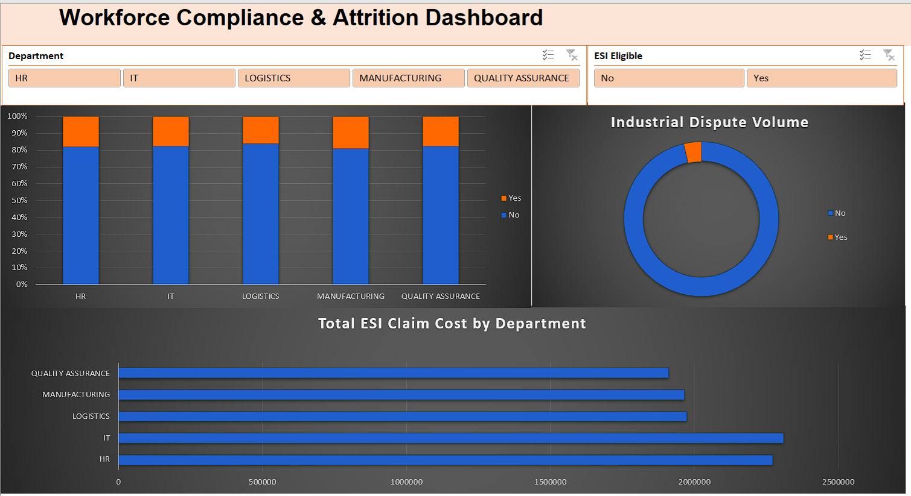

# Workforce Compliance & Attrition Dashboard

## 📌 Project Overview
This project transforms a raw, 5,000-record dataset of synthetic HR data into an interactive Excel dashboard. It was built to track employee turnover, highlight departments with high industrial dispute risks, and calculate the financial impact of Employee's State Insurance (ESI) claims based on Indian labor law logic.

## 🛠️ Tools Used
* **Microsoft Excel:** Data cleaning, Feature Engineering, Pivot Tables, Data Visualization.

## 🧹 Data Cleaning & Transformation
The raw dataset contained intentional messiness that required processing before analysis:
* **Standardization:** Utilized `=PROPER(TRIM())` to fix inconsistent capitalization and spacing in Department names.
* **Deduplication:** Identified and removed 50 duplicate employee records.
* **Imputation:** Addressed null values in compliance tracking (ESI claims and Disputes) and replaced impossible negative salary anomalies with the departmental median.
* **Feature Engineering:** Built a calculated column (`ESI_Eligible`) using `IF` logic to strictly categorize employees earning under ₹21,000 as legally eligible for ESI benefits.

## 📊 The Dashboard
*Interactive dashboard built using interconnected Pivot Tables, Slicers, and stacked visuals.*

## 💡 Key Insights
1. **Attrition Hotspots:** [Look at your chart and insert the department with the highest turnover here].
2. **Compliance Costs:** [Insert the department with the highest ESI claim cost here].
